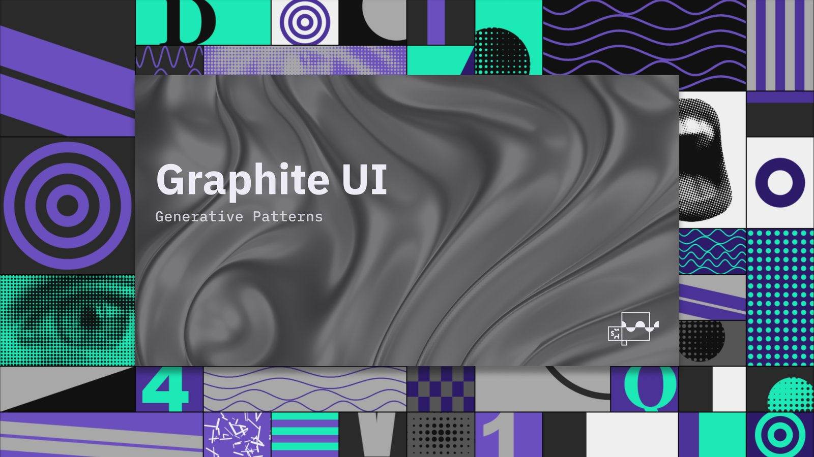

# Graphite UI

One color. A whole theme.

Pick a source color and Graphite builds the scales, the thirty-two roles and both themes, checking contrast as it goes. Thirty-six React components read those roles, each held by CI to a written contract and to the Figma kit.



## Use it

Set up a Next.js project with Tailwind, then add the init item, your theme and the Tailwind bridge:

```bash
npx shadcn@latest add https://www.graphite-ui.com/r/init.json https://www.graphite-ui.com/r/theme/0f766e.json https://www.graphite-ui.com/r/tailwind.json
```

Then add components:

```bash
npx shadcn@latest add https://www.graphite-ui.com/r/button.json
```

Swap `0f766e` for your own hex, or build a theme in [Create](https://www.graphite-ui.com/create) and take the code. The [Quick start](https://www.graphite-ui.com/docs/quick-start) walks through it, and [What you can use today](https://www.graphite-ui.com/docs#use-today) covers the theme, the Figma kit and the components.

There is no npm package. Components install as source files you own, the way shadcn/ui works.

## Documentation

Visit [graphite-ui.com/docs](https://www.graphite-ui.com/docs).

## Contributing

Please read the [contributing guide](CONTRIBUTING.md). Questions go to [Discussions](https://github.com/ssimorka/graphite-ui/discussions).

## License

Licensed under the [MIT license](LICENSE). The Graphite UI, Simorka Designs and SD System names and logos are not covered; see [TRADEMARKS.md](TRADEMARKS.md).
